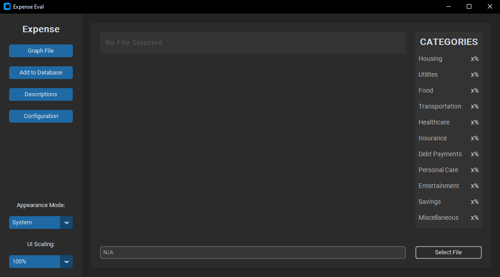

* * *

Expense Evaluation 
=======================

   

Overview 
-------- 

The Expense Evaluation is a work-in-progress program designed to help users categorize their expenses based on descriptions in their TRUIST bank statements. The program features a graphical user interface (GUI) that allows users to select a TRUIST bank statement file, extract its contents, and either store them in a database to help the model learn, or graph out their expenses so they can view what it is they are spending the most on. Using artificial intelligence (AI), the program attempts to predict the category to which each expense description belongs.

 

Features
--------

*   **Select File:** Users can select a TRUIST bank statement file using the GUI.
*   **Graph File:** The program extracts the contents of the statement and converts it into a pie graph for users to easily understand.
*   **Database Storing:** Extracted data is stored in a database for future reference.
*   **AI Prediction:** Utilizing AI algorithms, the program predicts the category of each expense description.
*   **Appearance Options:** Users can change the appearance of the application from either dark mode or light mode as well as scale the application to their liking.

Usage
-----

1.  **Select File:** Click the "Select File" button to choose a TRUIST bank statement file.
2.  **Graph File:** After selecting the file, click the "Graph File" button to extract and display its contents.
3.  **Add to Database:** Click the "Add to Database" button to store the extracted data in a database so that the language model can learn your expenses.
4.  **Configuration:** Finally, configuration allows for multiple configurational settings to better suit each user's needs.

Getting Started
---------------

To get started with the Bank Statement Analyzer, follow these steps:

1.  Clone the repository to your local machine.
2.  Install the required packages listed below using `pip install <package>`.
3.  Run the `toFile.py` file to initialize the database.
4.  Manually categorize entries in the `items.json` file for better AI accuracy.
5.  Run the main program to begin analyzing TRUIST bank statements.

Note 
----

*   This program is currently in development, and almost all commits will be done in the development branch. For contributions, it is recommended to download from the development branch.
*   The program currently only supports TRUIST bank statements due to a lack of access to other bank statements for development purposes.
*   **Important:** The more entries you categorize in the `items.json` file, the better and more accurate the AI model will be.
*   More features such as categorizing through the application, the ability to work with other bank statements, and category percentages will be added later on.

Packages Required
-----------------

*   `tkinter`
*   `customtkinter`
*   `matplotlib`
*   `pypdf`
*   `os`
*   `re`
*   `json`
*   `nltk`
*   `sklearn`

*** 